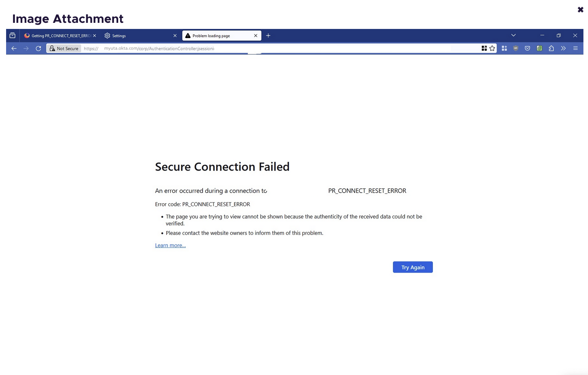
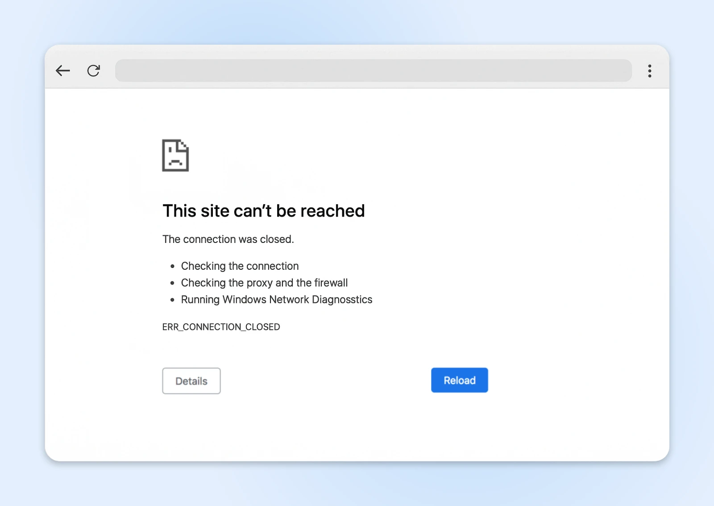

# INC-88421

**Customer:**  Dr. Aris Thorne	Senior Principal Investigator, Department of Bioengineering  
**Incident Number**  INC-88421  
**Affected Service:**  Mentis  
**Short description:**  URGENT: Intermittent Access to Research Portal and Grant Submission Site  
**Assignment Group:** Serice Desk  

---

## Description
I am currently attempting to finalize a grant submission due by COB today, but I am experiencing bizarre connectivity issues with the Entra login page. Sometimes the page loads perfectly, but other times, after I enter my credentials and approve the Push notification on my phone, the browser just spins indefinitely and eventually lands on a "Connection Reset" error page. I have tried switching from Chrome to Firefox, and the issue persists across both browsers.

My Research Assistant in the ERB building is having the same problem, though a colleague down the hall in the same department seems to be working just fine. This inconsistency is making it impossible to determine if the issue is with my laptop or the University network. Please investigate immediately as this is time-sensitive.

[Traceroute](../INC-88421-tracert)

