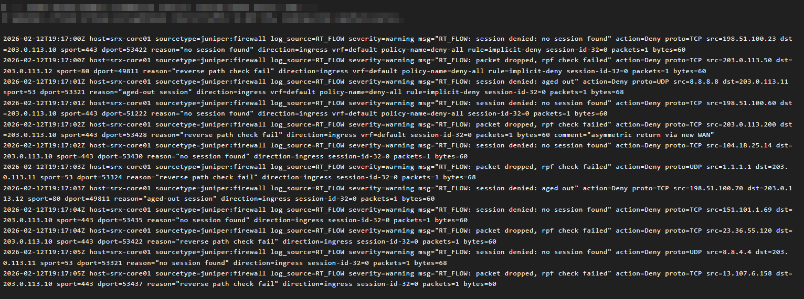
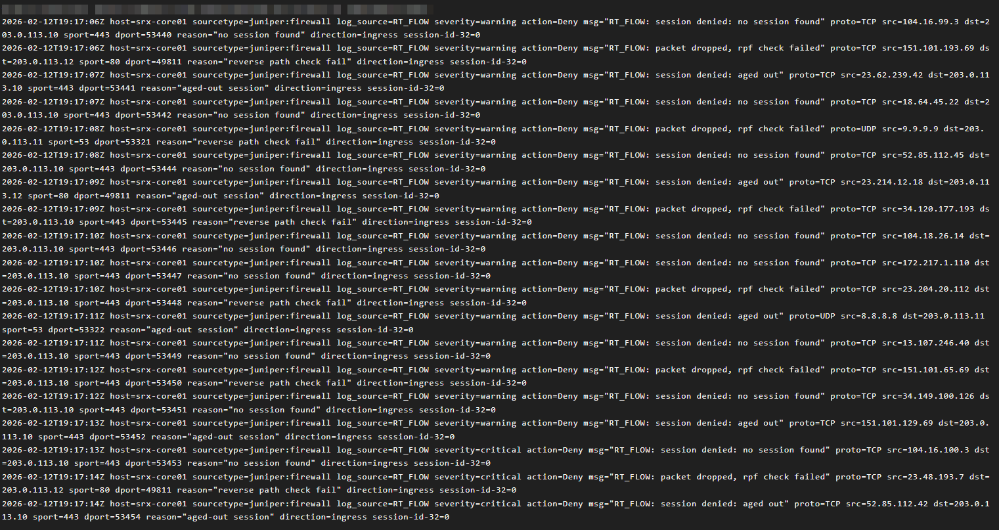

# Injection #3
*This injection is received by participants 30 minutes into the business continuity tabletop exercise.*

*Time: 2026-02-13 1:45 PM*

## Security Twist & User Impact
Security Ops sees a massive spike in "Deny" logs on the ERB-SRX for what appears to be legitimate return traffic from cloud services. This initially looks like a DDoS or spoofing attack.

Simultaneously, the help desk is being flooded with calls from users reporting they cannot log in to any cloud-based applications. Users state that they can enter their username and password, but the multi-factor authentication (MFA) prompt never appears, or the login times out.

Initial triage from the network team suggests that internal network traffic is flowing normally, and the issue seems to be isolated to external cloud services. A `tracert` from a user's machine to an external service like `portal.azure.com` seems to die just outside the corporate network.

